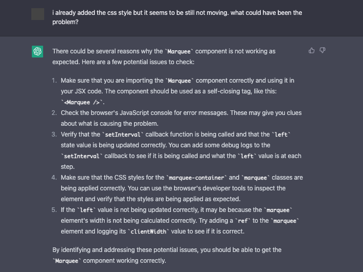

react-marquee
==========

This is a sample `Marquee` component that can be used in React project.
The code is based from the result from asking `OpenAI` [ChatGPT](https://openai.com/blog/chatgpt/) to make a `marquee` component.

In the early days of the web, there is a `<marquee>` HTML element that is used to display scrolling text like in neon signs. Well, let's bring back the good ole days.

Please use responsively :)

# Motivation

This is basically an exercise not of `React` but possible usage of `ChatGPT`.
I personally do not share some people's apprehension about it.
I think it complements the work of the programmer to be more efficient and productive and it is nice to have in one's toolbox.

As the exchange shown below illustrates, in order for the user to use `ChatGPT` effectively, specially in relation to code generated, they should have a foundational knowledge so that they can pinpoint errors and make appropriate adjustments, if necessary.

I share the exchanges with `ChatGPT` below:





# Usage

It is important that the container of the `Marquee` component has `width`, `height` and `overflow` set to `hidden`.

```javascript
import Marquee from './components/Marquee'

const Container = () => {
    return (
        <div style={styles.container}>
            <Marquee>Hello, world</Marquee>
        </div>
    )
}

const styles = {
    container: {
        width: '500px',
        height: '20px',
        overflow: 'hidden'
    }
}

```

> Please note that I moved the original `class component` to a separate file for reference and refactor it into `functional component` using hooks.

# Setup

Clone the repository, install the dependencies and run

```sh
$ git clone https://github.com/supershaneski/react-marquee.git myproject

$ cd myproject

$ npm install

$ npm start
```

Open your browser to `http://localhost:5173/` or some other port depending on the availability.
